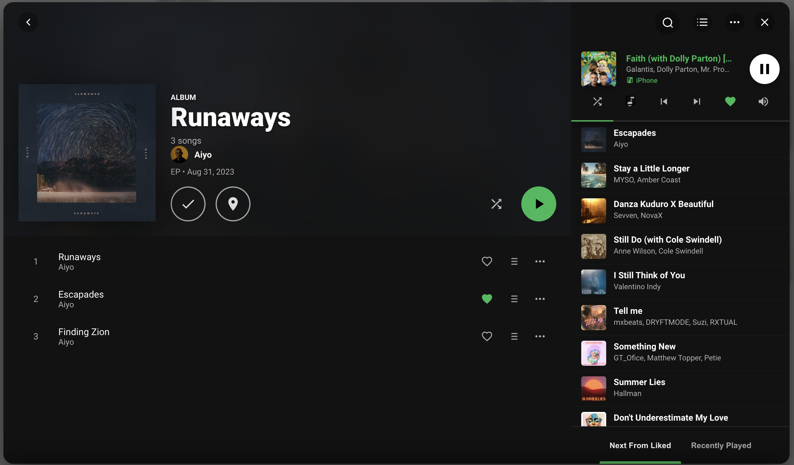
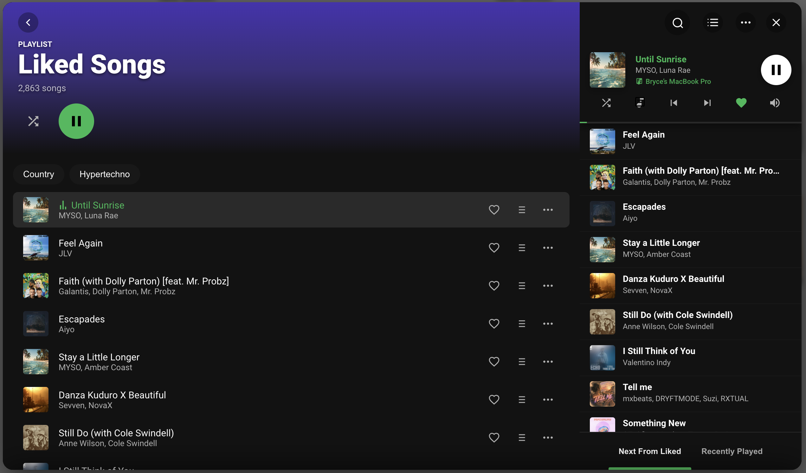
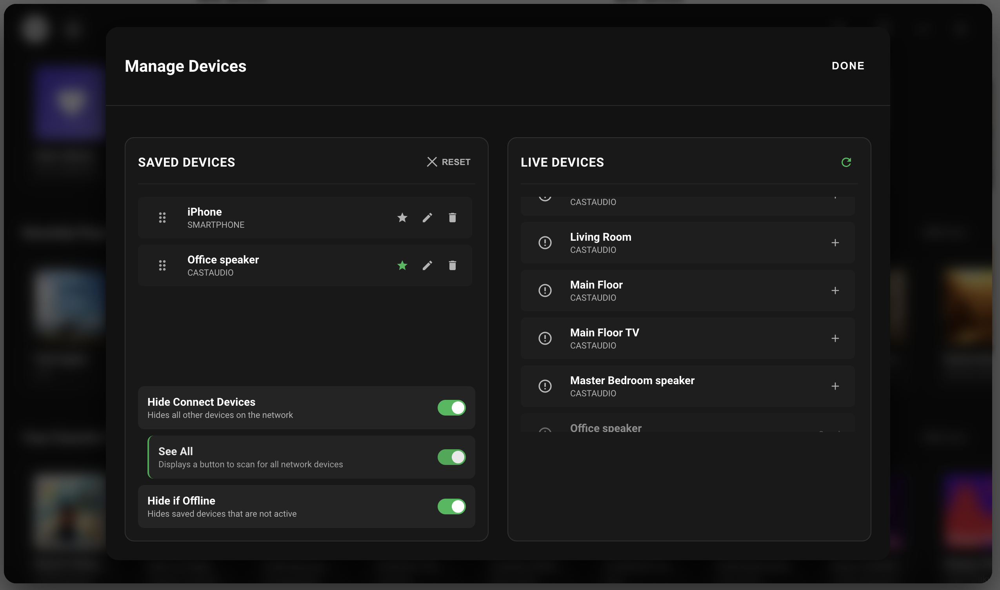
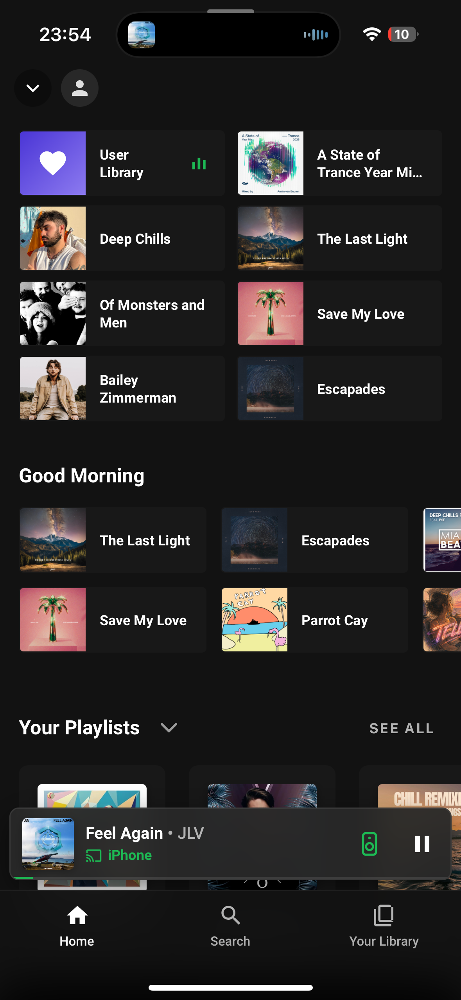
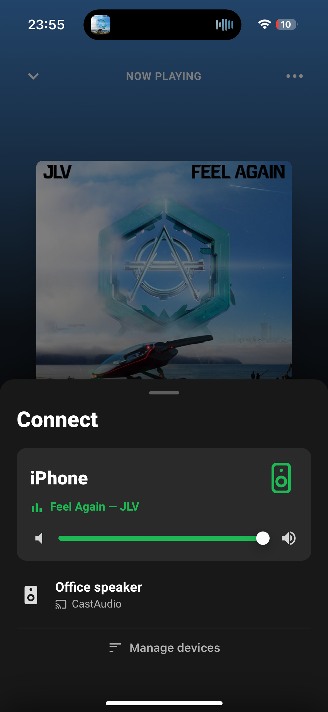

# Spotify Browser Card

A Home Assistant Lovelace custom card that renders a full-screen Spotify browser interface. It operates as a wrapper on top of the SpotifyPlus integration.

## Preview

### Desktop
<p align="center">
  
  
</p>
<p align="center">
  
  
</p>

### Mobile
<p align="center">
  
  
  
  
</p>


## Installation

1. Copy the `spotify-browser` folder to your Home Assistant `www/` directory.
2. Register the resource in your Lovelace dashboard configuration:

```yaml
resources:
  - url: /local/spotify-browser/index.js
    type: module
```

## Configuration

You can configure the card either at the root level of your Lovelace dashboard config or directly inside a custom card.

### Card Configuration

Add the card to a dashboard view:

```yaml
type: custom:spotify-browser-card
entity: media_player.spotify_user
cache_size: 15
performance: auto
```

### Dashboard Root Configuration

Define the configuration globally under the `spotify_browser:` key in your Lovelace dashboard YAML:

```yaml
spotify_browser:
  entity: media_player.spotify_user
  homeonexit:
    timeout: 300
  cache_size: 15
```

### Configuration Reference

| Key | Type | Default | Description |
| :--- | :--- | :--- | :--- |
| `entity` | string | none | The primary Spotify `media_player` entity. |
| `spotify_accounts` | list | none | List of accounts for multi-user switching. |
| `homeonexit` | boolean / object | `true` | Reset view to home screen on close. Supports `timeout` (seconds). |
| `device_playback` | object | none | Device helper (`input_select`), default volumes, and volume rules. |
| `queue` | object | none | Mini-player buttons and desktop sidebar visibility. |
| `cache_size` | number | `10` | Maximum pages retained in history. |
| `performance` | string | `auto` | Rendering profile: `auto`, `high` (full animations), or `low` (optimized). |
| `animations` | object | none | Configures transition types (`page_transition`, `browser_open`, `blur`). |
| `storage` | object | none | Entities and scripts used for persistent pinned items/device settings. |
| `homescreen` | object | none | Section visibility, ordering, and refresh timers. |
| `advanced` | object | none | Last.fm-based radio track generation and similar artist configurations. |
| `external_providers` | object | none | Integration credentials for external metadata services. |
| `auto_close_seconds` | number | `0` | Closes browser automatically after inactive seconds. `0` disables. |
| `closeondisconnect` | boolean | `true` | Closes the browser interface if connection to Home Assistant is lost. |
| `custom_hash` | string | `#spotify-browser` | URL hash that triggers the browser layout. |
| `desktop_style` | object | none | Dimensions, margins, and sizing modes for desktop viewports. |

### Detailed Option Schemas

#### homeonexit
Controls browser state reset on close/reopen. Can be `true` (always reset to Home), `false` (remember last page forever), or an object:
* `timeout` (number): Remembers last page for N seconds, then resets to Home.

#### device_playback
* `helper` / `device_manager` (string): Entity ID of an `input_select` helper to store and persist selected devices.
* `hide` (list): Device names to filter out of the device picker.
* `show` (list): Device names to explicitly include in the picker.
* `default` / `default_device` (string): Device ID to use as a fallback.
* `volume` (object): Time-based volume levels and slider parameters:
  * `default` (number / object): Fallback volume (e.g. `25`), or an object containing:
    * `fallback` (number): Default volume used when no rules match.
    * `rules` (list): Time-based rules containing `start` (HH:MM), `end` (HH:MM), and `level` (0-100 percentage).
  * `slider` (object): Volume slider behavior:
    * `rate_control` (boolean): Throttle volume service calls (default: `true`).
    * `optimistic` (boolean): Update UI volume slider state immediately (default: `true`).

#### queue
* `desktop` (object): Desktop viewport settings:
  * `open_init` (boolean): Open the queue sidebar panel automatically when the browser opens (default: `false`).
  * `miniplayer` (boolean / object): If `true`, enables the mini-player. Or configure buttons individually:
    * `shuffle`, `previous`, `next`, `like`, `volume`, `device` (boolean).

#### homescreen
* `cache` (boolean): Cache homescreen data for faster loads (default: `true`).
* `expiry` (number): Expiry window in minutes before refreshing cached data (default: `60`).
* `sort` (list): Section sorting order. Allowed items: `pinned`, `recently played`, `followed_artists`, `favourite_playlists`, `favourite_albums`, `made_for_you`.
* `sticky` (object): Configures pinned elements:
  * `helper` / `pinned_items_entity` (string): Entity ID of an `input_select` helper to persist pins.
  * `limit` (number): Maximum number of pinned items to display (default: `10`).
* `madeforyou` (list / object): If object, supports:
  * `content` / `items` (list): Custom playlists/albums.
  * `pills` / `desktop_pills` (boolean): Enable genre pills styling on desktop.

#### advanced
* `similar_artists` (object):
  * `provider` (string): External metadata provider (e.g., `'lastfm'`).
  * `limit` (number): Max recommendations to fetch (default: `10`).
* `radio_track` (object):
  * `enabled` (boolean): Generates a custom track radio when playing.
  * `provider` (string): Metadata provider (e.g., `'lastfm'`).
  * `limit` (number): Maximum radio track queue size (default: `30`).
  * `dontstopthemusic` (boolean): Continues track radio play indefinitely.

#### desktop_style
* `mode` (string): Dialog sizing method (`'default'`, `'fixed'`, `'fullscreen'`).
* `width` (string): Width in CSS units (e.g. `'1000px'`).
* `height` (string): Height in CSS units (e.g. `'700px'`).
* `margin` (string): Margin around the window on desktop viewports.
* `margin_top`, `margin_bottom`, `margin_left`, `margin_right` (string): Individual overrides.

### Persistent Storage Setup

To enable pinning items and saving device settings, configure a template sensor in your `configuration.yaml` and a helper script in your `scripts.yaml`.

#### 1. Home Assistant Template Sensor

```yaml
template:
  - trigger:
      - platform: event
        event_type: spotify_browser_store_data
    sensor:
      - name: Spotify Browser Data
        unique_id: spotify_browser_data
        state: "{{ now().timestamp() | int }}"
        attributes:
          data: "{{ trigger.event.data.data | to_json }}"
```

#### 2. Helper Script (Optional - allows non-admin/guest editing)

```yaml
spotify_browser_store:
  alias: Spotify Browser Store Data
  mode: queued
  fields:
    data:
      description: Full data object to persist
  sequence:
    - condition: template
      value_template: "{{ data is mapping }}"
    - event: spotify_browser_store_data
      event_data:
        data: "{{ data }}"
```

#### 3. Lovelace Card Storage Reference

```yaml
type: custom:spotify-browser-card
entity: media_player.spotify_user
storage:
  sensor_entity: sensor.spotify_browser_data
  event_type: spotify_browser_store_data
  write_script: script.spotify_browser_store
```

### Multi-Account Support

You can configure multiple Spotify accounts and switch between them within the interface:

```yaml
type: custom:spotify-browser-card
spotify_accounts:
  - name: "User A"
    entity: media_player.spotify_user_a
    default: true
    hash: "#user-a"
  - name: "User B"
    entity: media_player.spotify_user_b
    hash: "#user-b"
```

## Triggers

Open the browser using URL hashes or JavaScript window events.

### URL Hashes

Navigate or link directly to these hashes:
- `#spotify-browser` - Opens the main browser
- `#spotify-browser-now-playing` - Opens the now playing view on mobile
- `#user-a` - Opens the browser and switches to the specified account

### JavaScript Events

Trigger the browser programmatically:

```javascript
// Open the browser
window.dispatchEvent(new CustomEvent('spotify-browser-open'));

// Open directly to mobile now-playing screen
window.dispatchEvent(new CustomEvent('spotify-browser-open-now-playing'));
```

## Complete Configuration Example

Below is a complete configuration example demonstrating all available options:

```yaml
type: custom:spotify-browser-card
entity: media_player.spotify_user 

homeonexit:
  timeout: 300 # 5 minutes

device_playback:
  helper: input_select.spotify_browser_device_manager
  hide:
    - "Living Room Speaker"
  show:
    - "Kitchen Speaker"
  default: "speaker_kitchen"
  volume:
    default:
      fallback: 25
      rules:
        - start: '09:00'
          end: '17:00'
          level: '35'
        - start: '22:00'
          end: '07:00'
          level: '15'
    slider:
      rate_control: true
      optimistic: true

queue:
  - desktop:
      open_init: true
      miniplayer:
        shuffle: true
        previous: true
        next: true
        like: true
        volume: true
        device: true

cache_size: 15
performance: auto

animations:
  page_transition: fade # 'fade', 'slide', 'none'
  browser_open: fade
  blur: true

spotify_accounts:
  - name: "Bryce"
    entity: media_player.spotify_bryce
    default: true
    hash: "#bryce"
    image: "/local/spotify/bryce.jpg"
  - name: "Alice"
    entity: media_player.spotify_alice
    hash: "#alice"

storage:
  sensor_entity: sensor.spotify_browser_data
  event_type: spotify_browser_store_data
  write_script: script.spotify_browser_store

homescreen:
  cache: true
  expiry: 60 # minutes
  sticky:
    helper: input_select.spotify_pinned_items
    limit: 10
  madeforyou:
    content:
      - id: "37i9dQZF1DXcBWIGoYBM5M"
        title: "Top Hits"
        type: "playlist"
    desktop_pills: true
  sort:
    - pinned
    - recently played
    - made_for_you
    - favourite_playlists
    - followed_artists
    - favourite_albums

advanced:
  radio_track:
    enabled: true
    provider: "lastfm"
    limit: 30
    dontstopthemusic: true
  similar_artists:
    provider: "lastfm"
    limit: 10

external_providers:
  lastfm:
    api_key: "YOUR_LASTFM_API_KEY"

auto_close_seconds: 0
closeondisconnect: true
custom_hash: "#spotify-browser"

desktop_style:
  mode: fixed
  width: 1000px
  height: 700px
  fullscreen: false
  margin: 32px
```

